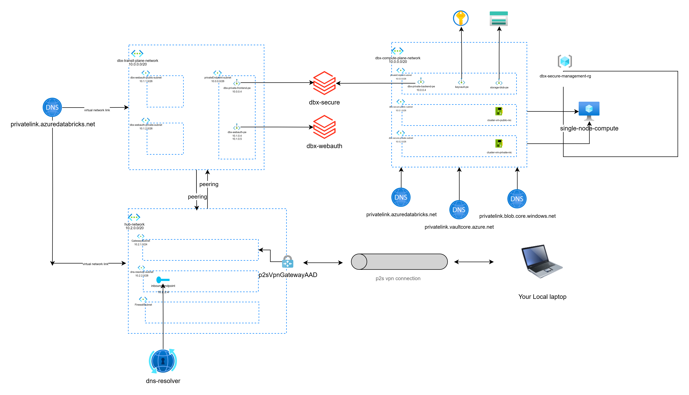

# Secure Databricks Private Link Deployment

This project automates the deployment of a secure Databricks workspace with private endpoints and Point-to-Site (P2S) VPN connectivity. It enables secure access to Databricks from on-premise machines while maintaining network isolation.



## Architecture Overview

The deployment creates two main components:

1. **Network Infrastructure** (`networkAppliance.bicep`):
   - Virtual Network Gateway for P2S VPN
   - VPN Gateway configuration
   - Network security groups
   - Required subnets for VPN connectivity

2. **Databricks Infrastructure** (`main.bicep`):
   - Two Databricks workspaces:
     - Main workspace for data processing
     - Web authentication workspace for secure login
   - Private endpoints for:
     - Databricks UI/API access
     - Web authentication
   - Private DNS zones
   - Storage account with private endpoints
   - Resource groups for network, transit, and data plane

## Prerequisites

- Azure CLI installed and configured
- Appropriate Azure subscription permissions
- Python 3.x installed (for cleanup script)

## Deployment Steps

1. **Clean Previous Deployment** (if needed):
   ```bash
   make clean
   ```

2. **Deploy Network Infrastructure**:
   ```bash
   make deploy_network
   ```
   This will create:
   - Virtual Network Gateway
   - VPN Gateway
   - Network security groups
   - Required subnets

3. **Deploy Databricks Infrastructure**:
   ```bash
   make deploy_dx
   ```
   This will create:
   - Databricks workspaces
   - Private endpoints
   - Private DNS zones
   - Storage account
   - Resource groups

## Post-Deployment Steps

1. **Configure VPN Client**:
   - Download the VPN client configuration from the Azure portal
   - Install the configuration on your on-premise machine
   - Connect to the VPN

2. **Access Databricks**:
   - Once connected to the VPN, access the Databricks workspace through the private endpoint
   - Use the web authentication workspace for secure login

## Security Features

- Private endpoints for all Databricks services
- Network isolation between control and data planes
- P2S VPN for secure on-premise access
- Private DNS zones for name resolution
- Storage account with private endpoints
- Network security groups for traffic control

## Cleanup

To remove all deployed resources:
```bash
make clean
```

## Notes

- The deployment uses East US region by default
- All resources are tagged with project and environment information
- The storage account is configured with hierarchical namespace (ADLS Gen2)
- Network security is configured to deny public access by default

## Troubleshooting

If you encounter issues:
1. Check the Azure portal for deployment errors
2. Verify VPN connectivity
3. Ensure all private endpoints are properly configured
4. Check DNS resolution for private endpoints 